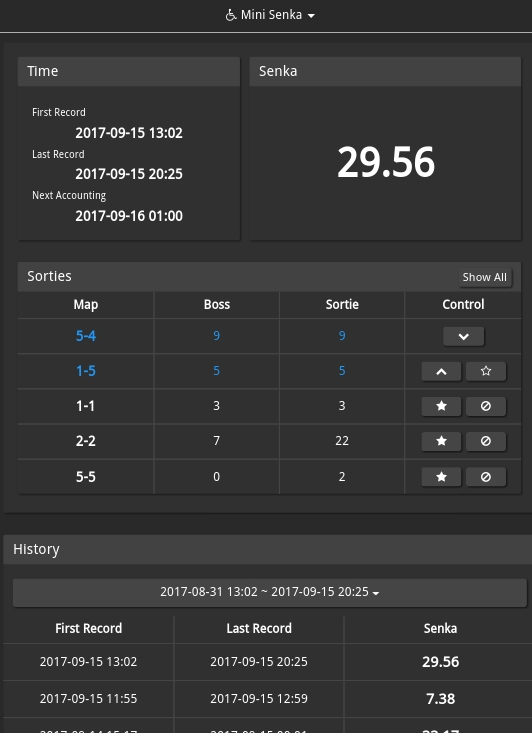
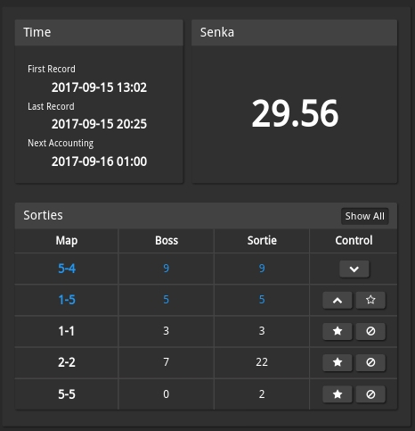
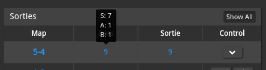
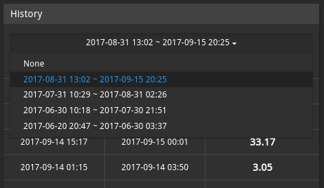
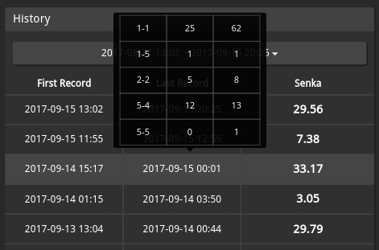

Mini Senka is a [poi](https://github.com/poooi/poi) plugin that provides
simple but useful information to assist your monthly ranking.

To install, go to "Settings > Plugins". Find the line saying "Input plugin package name...",
type in `poi-plugin-mini-senka` and click "Install" button.

Note that this plugin only takes into account senka obtained from admiral experience.
Therefore senka obtained from clearing EO, or "Z-cannon"
(i.e. +350 senka upon clearing quarterly quest "戦果拡張任務！「Z作戦」前段作戦")
is not counted.

# Changelog

### 0.4.2

- UI tweak
- History will focus on most recent recorded month upon start.

# Introduction

The UI consists of two parts: current senka & senka history.

## Current Senka

This part shows next accounting time, and accumulated senka during current period.

A table of sortie records is also available:

- Each row represents a map.

- "Sortie" column counts the total number of sorties to that map

- "Boss" column represents the number of times you obtain a rank in boss node.
  You can move mouse over boss cells to see details about battle ranks.

There are also simple controls for you to rearrange table columns:

- Click "★" to favorite a map, a favorited map always shows on top of the table.

- Click "🛇" to hide a map

- For a favorited map:

    - Use up/down chevron button to rearrange them
    - When the map in question is the last favorite item in the table, click "☆" to unfavorite it.

- For a hidden map

    - you can still see them by activating "Show All" button
    - Click "+" to unhide it.

## Senka History

Scroll down and choose a period (groupped by month), you'll see your senka history of that month.

Move mouse over a row, and sortie history will pop up.

